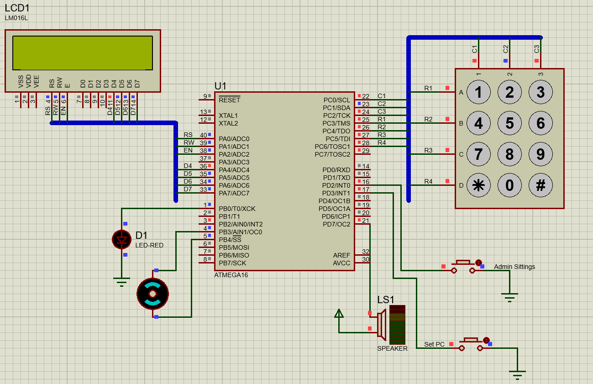

# Embedded Lock System Documentation

## Table of Contents

- [Overview](#overview)
- [Features](#features)
- [Getting Started](#getting-started)
  - [Prerequisites](#prerequisites)
  - [Installation](#installation)
  - [Usage](#usage)
  - [Proteus Simulation](#proteus-simulation)
- [Main Program Flowchart](#main-program-flowchart)
- [Developers](#developers)
- [Main function](#main-function)
- [Header file](#header-file)

## Overview

The Embedded Lock System is a collaborative project designed to implement a secure lock system. The system utilizes Proteus 8 Professional for simulation and CodeVisionAVR Evaluation for programming the ATmega16 microcontroller. Written in the C programming language, the system encompasses three main functionalities: opening the door, setting a new passcode (PC), and accessing administrative features. The project is organized into three distinct parts, with each part expertly handled by different contributors.

## Features

- Password-based Access Control
- LCD Display for User Interaction
- Audible Alarms for Incorrect Entries

### Define interrupts priorities:

(Recommended):

- Press the Open button to open the door, triggering button '\*'.
- Prioritize the Admin button by associating it with interrupt INT0.
- Set the PC configuration with the Set PC button, utilizing interrupt INT1.

> The project favors this Option because it assigns higher priority to the Admin button, followed logically by the Set PC button, and then the Open button.

## Getting Started

### Prerequisites

Ensure you have the following tools and components:

- Proteus 8 Professional
- CodeVisionAVR Evaluation
- ATmega16 Microcontroller
- Other necessary components (LCD, DC Motor, Buzzer, Keypad)

### Installation

1. Clone the repository:

   ```bash
   git clone https://github.com/Hussein119/lock-system.git
   cd lock-system
   ```

2. Open the project in CodeVisionAVR.

   - Launch CodeVisionAVR and open the project file (`\Code\Project #1 lock system.prj`).
   - Customize project settings if necessary.

3. Simulate in Proteus.

   - Open Proteus 8 Professional.
   - Load the simulation file (`\Simulation\Project #1 lock system.pdsprj`) and run the simulation.

4. Hardware Implementation.

   - Connect the ATmega16 to the necessary components.
   - Program the microcontroller using CodeVisionAVR.

### Usage

Test the lock system with the predefined password, verify LED indicators, and explore other functionalities.

### Proteus Simulation

#### Hardware Components

1. ATmega16 Microcontroller
2. LCD Display
3. Keypad 4x3
4. Red light (for door simulation)
5. Speaker (Peeps alarm)
6. Keypad 4x3
7. Three Buttons for interrupts



## Main Program Flowchart

### Open Door Flowchart


### Set New PC Flowchart


### Admin Sittings Flowchart


## Developers

- Islam AbdElhady Hassanein
- Ahmed Hesham Fathall Farag
- Elsherif Shapan Abdelmageed
- Hussein AbdElkader Hussein
- Enas Ragab AbdEllatif
- Mariam Tarek Saad

## Main Function

- LockSystem.c

```c
/*
 * Project #1 lock system.c
 *
 * Created: 12/16/2023 1:47:34 AM
 * Author: Hos10
 */

#include "lockSys.h"

void main(void)
{
	char input;

	// Initialize Hardware
	initializeHardware();

	// Initialize user data in EEPROM
	initializeUsers();

	// Initialize interrupts for various modes
	initializeIntrrupts();

	// If user need to open the door must press '*' on the keypad
	while (1)
		{
		input = keypad();
		if (input == '*')
			openCloseDoorMode();
		}
}

interrupt[3] void setPC(void) //  vector no 3 -> INT1
{
	setPCMode();
}

interrupt[2] void admin(void) // vector no 2 -> INT0
{
	adminMode();
}
```

## Header File

- lockSys.h

```c
#include <mega16.h>
#include <alcd.h>
#include <delay.h>
#include <string.h>

// Macros for setting and clearing bits in a register
#define bit_set(r, b) r |= 1 << b
#define bit_clr(r, b) r &= ~(1 << b)

// Function prototypes
void initializeHardware();
void initializeKeypad();
void initializeDoor();
void initializeSpeaker();
void initializeIntrrupts();
char keypad();
unsigned char EE_Read(unsigned int address);
void EE_Write(unsigned int address, unsigned char data);
void EE_WriteString(unsigned int address, const char *str);
void EE_ReadString(unsigned int address, char *buffer, unsigned int length);
void initializeUsers();
void displayMessage(char *message, int delay_ms_value);
int enterValueWithKeypad(char *buffer);
void generateTone();
void adminMode();
void setPCMode();
void openCloseDoorMode();

// User structure to store user data
typedef struct
{
	char name[6];
	char id[4];
	char pc[4];
} User;
// Array of user data
User users[] =
{
		// name   ID     PC
		{"Prof", "111", "203"},
		{"Ahmed", "126", "129"},
		{"Amr", "128", "325"},
		{"Adel", "130", "426"},
		{"Omer", "132", "079"},
};

// Function to initialize hardware components
void initializeHardware()
{
	initializeKeypad();
	lcd_init(16); // Initialize the LCD
	initializeDoor();
	initializeSpeaker();
}

// Function to initialize keypad
void initializeKeypad()
{
	// Set keypad ports
	DDRC = 0b00000111;	// 1 unused pin, 4 rows (input), 3 columns (output)
	PORTC = 0b11111000; // pull-up resistance
}

// Function to initialize door
void initializeDoor()
{
	DDRB .0 = 0; // Set the door as input (by default, the door is closed)
	PORTB .0 = 1; // turn on pull-up resistance
}

// Function to initialize speaker
void initializeSpeaker()
{
	DDRD .7 = 1; // Set the speaker as an output
	PORTD .7 = 1; // Set it to 1 initially
}

// Function to initialize interrupts
void initializeIntrrupts()
{
	DDRB .2 = 0;  // make button as input
	PORTB .2 = 1; // turn on pull up resistance for INT2 intrrupt

	// actual casue INT2
	bit_set(MCUCSR, 6);

	DDRD .2 = 0;  // make button as input
	PORTD .2 = 1; // turn on pull up resistance for INT0 intrrupt

	// actual casue (The falling edge of INT0)
	bit_set(MCUCR, 1);
	bit_clr(MCUCR, 0);

	// actual casue (The falling edge of INT1)
	bit_set(MCUCR, 3);
	bit_clr(MCUCR, 2);

	DDRD .3 = 0;  // make button SetPC as input
	PORTD .3 = 1; // turn on pull up resistance

	// Enable global interrupts
#asm("sei")

	// GICR INT1 (bit no 7) , SetPC spacific enable
	bit_set(GICR, 7);

	// GICR INT2 (bit no 5) , open spacific enable
	bit_set(GICR, 5);

	// GICR INT0 (bit no 6) , admin spacific enable
	bit_set(GICR, 6);
}

// Function: keypad
// Description: Reads the input from a 4x3 matrix keypad and returns the corresponding key value.
//              The keypad is connected to port C, and the function scans each row and column
//              combination to determine the pressed key.
// Returns: Character representing the pressed key.
char keypad()
{
	while (1)
	{
		PORTC .0 = 0;
		PORTC .1 = 1;
		PORTC .2 = 1;

		switch (PINC)
		{
		case 0b11110110:
			while (PINC .3 == 0)
				;
			return 1;
		case 0b11101110:
			while (PINC .4 == 0)
				;
			return 4;
		case 0b11011110:
			while (PINC .5 == 0)
				;
			return 7;
		case 0b10111110:
			while (PINC .6 == 0)
				;
			return '*';
		}

		PORTC .0 = 1;
		PORTC .1 = 0;
		PORTC .2 = 1;

		switch (PINC)
		{
		case 0b11110101:
			while (PINC .3 == 0)
				;
			return 2;
		case 0b11101101:
			while (PINC .4 == 0)
				;
			return 5;
		case 0b11011101:
			while (PINC .5 == 0)
				;
			return 8;
		case 0b10111101:
			while (PINC .6 == 0)
				;
			return 0;
		}

		PORTC .0 = 1;
		PORTC .1 = 1;
		PORTC .2 = 0;

		switch (PINC)
		{
		case 0b11110011:
			while (PINC .3 == 0)
				;
			return 3;
		case 0b11101011:
			while (PINC .4 == 0)
				;
			return 6;
		case 0b11011011:
			while (PINC .5 == 0)
				;
			return 9;
		case 0b10111011:
			while (PINC .6 == 0)
				;
			return 11;
		}
	}
}

// Function to read from EEPROM
unsigned char EE_Read(unsigned int address)
{
	while (EECR .1 == 1); // Wait till EEPROM is ready
	EEAR = address; // Prepare the address you want to read from
	EECR .0 = 1;	// Execute read command
	return EEDR;
}

// Function to write to EEPROM
void EE_Write(unsigned int address, unsigned char data)
{
	while (EECR .1 == 1); // Wait till EEPROM is ready
	EEAR = address; // Prepare the address you want to read from
	EEDR = data;	// Prepare the data you want to write in the address above
	EECR .2 = 1;	// Master write enable
	EECR .1 = 1;	// Write Enable
}

// Function to write a string to EEPROM
void EE_WriteString(unsigned int address, const char *str)
{
	// Write each character of the string to EEPROM
	while (*str)
	EE_Write(address++, *str++);
	// Terminate the string with a null character
	EE_Write(address, '\0');
}

// Function to read a string from EEPROM
void EE_ReadString(unsigned int address, char *buffer, unsigned int length)
{
	unsigned int i;
	for (i = 0; i < length; ++i)
	{
		buffer[i] = EE_Read(address + i);
		if (buffer[i] == '\0')
			break;
	}
}

// Function to initialize user data in EEPROM
void initializeUsers()
{
	unsigned int address = 0;
	int i;
	for (i = 0; i < sizeof(users) / sizeof(users[0]); ++i)
	{
		EE_WriteString(address, users[i].name);
		address += sizeof(users[i].name);

		EE_WriteString(address, users[i].id);
		address += sizeof(users[i].id);

		EE_WriteString(address, users[i].pc);
		address += sizeof(users[i].pc);
	}
}

// Function to display a message on the LCD
void displayMessage(char *message, int delay_ms_value)
{
	lcd_clear();
	lcd_puts(message);
	delay_ms(delay_ms_value);
}

// Function to enter a value with the keypad
int enterValueWithKeypad(char *buffer)
{
	buffer[0] = keypad() + '0';
	lcd_putchar(buffer[0]);
	buffer[1] = keypad() + '0';
	lcd_putchar(buffer[1]);
	buffer[2] = keypad() + '0';
	lcd_putchar(buffer[2]);
	buffer[3] = '\0'; // Null-terminate the string

	delay_ms(1000);

	return 1; // Return a non-zero value to indicate success
}

// Function to generate a tone with speaker
void generateTone()
{
	PORTD .7 = 1;
	delay_ms(500);
	PORTD .7 = 0;
    delay_ms(500);
    PORTD .7 = 1;
}

// Interrupt functions

// Function for admin mode
void adminMode()
{
	char enteredPC[4];
	char enteredStudentID[4];
	char enteredNewPC[4];
	User student;
	User admin;
	unsigned int adminPCAddress = 0;
	unsigned int address = 0;
	int userFound = 0;
	int i;

	for (i = 0; i < sizeof(users) / sizeof(users[0]); ++i)
	{
		EE_ReadString(address, admin.name, sizeof(users[i].name));
		if (strcmp(admin.name, "Prof") == 0)
		{
			address += sizeof(users[i].name);
			EE_ReadString(address, admin.id, sizeof(admin.id));
			address += sizeof(users[i].id);
			EE_ReadString(address, admin.pc, sizeof(admin.pc));
			adminPCAddress = address;
			break;
		}
		address += sizeof(users[i].pc);
	}

	address = 0; // reset the address

	displayMessage("Enter Admin PC: ", 1000);
	lcd_gotoxy(0, 1);

	if (enterValueWithKeypad(enteredPC))
	{

		if (strcmp(admin.pc, enteredPC) == 0)
		{
			displayMessage("Enter Student ID: ", 1000);

			if (enterValueWithKeypad(enteredStudentID))
			{
				int j;
				for (j = 0; j < sizeof(users) / sizeof(users[0]); ++j)
				{
					address += sizeof(users[j].name);
					EE_ReadString(address, student.id, sizeof(student.id));
					address += sizeof(users[j].id);
					if (strcmp(student.id, enteredStudentID) == 0)
					{
						displayMessage("Enter student's new PC: ", 1000);
						if (enterValueWithKeypad(enteredNewPC))
						{
							// Set the new pc for this student, address is for student PC
							EE_WriteString(address, enteredNewPC);
							displayMessage("Student PC is stored", 3000);
							userFound = 1;
							break;
						}
					}
					else if (strcmp(admin.id, enteredStudentID) == 0)
					{
						displayMessage("Enter your new PC: ", 1000);
						lcd_gotoxy(0, 1);
						if (enterValueWithKeypad(enteredNewPC))
						{
							// Set the new pc for this user (Admin),  address is for admin PC
							EE_WriteString(adminPCAddress, enteredNewPC);
							displayMessage("Your PC is stored", 3000);
							userFound = 1;
							break;
						}
					}
					address += sizeof(users[i].pc);
				}
			}
		}
	}

	if (!userFound)
	{
		displayMessage("Contact Admin", 3000);
		// Two peeps alarm
		generateTone();
		generateTone();
	}
	delay_ms(5000);
	lcd_clear();
}

// Function for set PC mode
void setPCMode()
{
	char enteredID[5]; // Change data type to string
	User currentUser;
	unsigned int address = 0;
	int userFound = 0;
	int i;
	char enteredNewPC[5];	// define enteredNewPC array to hold the new PC
	char reenteredNewPC[5]; // define reenteredNewPC array to hold the Re-entered new PC

	lcd_clear();
	displayMessage("Enter your ID:", 1000);
	lcd_gotoxy(0, 1);
	if (enterValueWithKeypad(enteredID))
	{
		char enteredOldPC[5];
		// search for the entered ID in the user data
		for (i = 0; i < sizeof(users) / sizeof(users[0]); ++i)
		{
			address += sizeof(users[i].name);
			EE_ReadString(address, currentUser.id, sizeof(currentUser.id)); // Read ID as a string

			if (strcmp(currentUser.id, enteredID) == 0)
			{
				// ID found, verify the old PC
				address += sizeof(currentUser.id);
				EE_ReadString(address, currentUser.pc, sizeof(currentUser.pc)); // Read PC as a string
				displayMessage("Enter old PC:", 1000);
				lcd_gotoxy(0, 1);

				if (enterValueWithKeypad(enteredOldPC))
				{
					if (strcmp(currentUser.pc, enteredOldPC) == 0)
					{
						// Old PC verified
						displayMessage("Enter new PC:", 1000);
						lcd_gotoxy(0, 1);
						enterValueWithKeypad(enteredNewPC);

						lcd_clear();
						displayMessage("Re-enter new PC:", 1000);
						lcd_gotoxy(0, 1);
						enterValueWithKeypad(reenteredNewPC);

						if (strcmp(enteredNewPC, reenteredNewPC) == 0)
						{
							// If new PC entered correctly, store it
							EE_WriteString(address, enteredNewPC);
							displayMessage("New PC stored", 1000);
						}
						else
						{
							displayMessage("New PC mismatch, Contact admin", 1000);
							generateTone();
							generateTone();
						}
					}
					else
					{
						displayMessage("Wrong old PC,   Contact admin", 1000);

						generateTone();
						generateTone();
					}
				}

				userFound = 1;
				break;
			}

			address += sizeof(users[i].id);
			address += sizeof(users[i].pc);
		}

		if (!userFound)
		{
			displayMessage("Wrong ID", 1000);
			generateTone();
			generateTone();
		}
		delay_ms(5000);
		lcd_clear();
	}
}

// Function for open/close door mode
void openCloseDoorMode()
{
	char enteredID[4]; // Change data type to string
	User currentUser;
	unsigned int address = 0;
	int userFound = 0;
	int i;

	displayMessage("Enter your ID: ", 1000);
	lcd_gotoxy(0, 1);

	if (enterValueWithKeypad(enteredID))
	{
		char enteredPC[4];
		for (i = 0; i < sizeof(users) / sizeof(users[0]); ++i)
		{
			EE_ReadString(address, currentUser.name, sizeof(users[i].name));
			address += sizeof(users[i].name);
			EE_ReadString(address, currentUser.id, sizeof(currentUser.id)); // Read ID as a string

			if (strcmp(currentUser.id, enteredID) == 0)
			{

				address += sizeof(users[i].id);
				EE_ReadString(address, currentUser.pc, sizeof(currentUser.pc)); // Read PC as a string

				displayMessage("Enter your PC: ", 1000);
				lcd_gotoxy(0, 1);

				if (enterValueWithKeypad(enteredPC))
				{
					if (strcmp(currentUser.pc, enteredPC) == 0)
					{
						lcd_clear();
						lcd_puts("Welcome, ");
						lcd_puts(currentUser.name);
						// Open the door
						DDRB .0 = 1;
					}
					else
					{
						displayMessage("Sorry wrong PC", 1000);
						// one peep alarm
						generateTone();
					}
				}
				userFound = 1;
				break;
			}

			address += sizeof(users[i].id);
			address += sizeof(users[i].pc);
		}
	}

	if (!userFound)
	{
		displayMessage("Wrong ID", 1000);
		// Two peeps alarm
		generateTone();
		generateTone();
	}
	delay_ms(5000);
	// close the door and clear lcd
	DDRB .0 = 0;
	lcd_clear();
}
```
